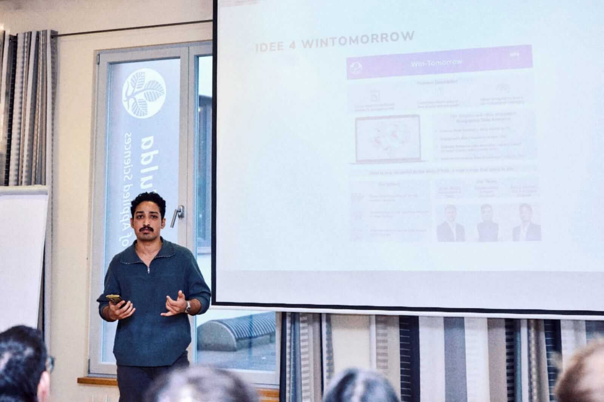

Twice nominated at state and university level, winning audience award and third
prize in hessen start-up ideas competition, this project features geo-analytics to
power political campaigning insights.

